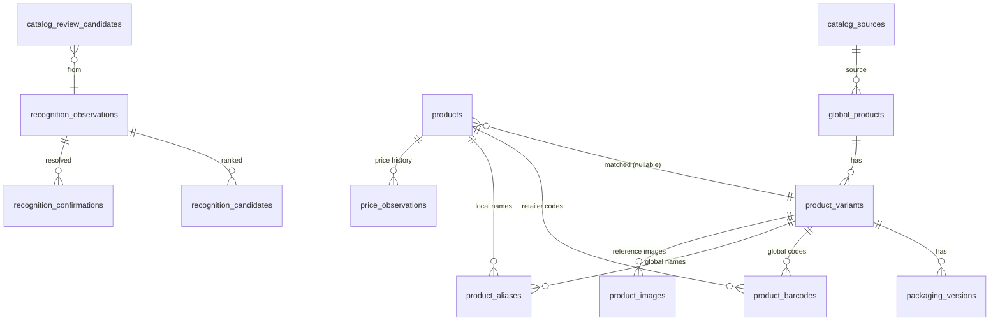

# Phase 2 — Product Knowledge Base

Additive foundation that separates **market identity** (shared) from
**retailer business data** (private). Nothing in the existing product / sale /
inventory / barcode flow was replaced; every new column is nullable/defaulted
and the deployed APK's endpoints (`/api/catalog/*`) are untouched. The enhanced
paths live under a new `/api/kb/*` prefix behind feature flags.

## Data ownership

| Layer | Examples | Who may change it |
|---|---|---|
| **Shared catalog** | global product, variant, packaging version, verified barcode/alias | catalog admins only (via review) |
| **Retailer** | `products` row: selling price, cost, stock, local name, supplier, active | the retailer |
| **Observation** | recognition observations/candidates/confirmations, price observations | append-only, tenant-scoped |

A retailer **never** overwrites shared data directly — a correction becomes a
**retailer override** or a **catalog review candidate** (never auto-published).

## Entity relationships

## Verification states & trust levels
- **verification_status**: `unverified → retailer_confirmed → multi_retailer → distributor → manufacturer → admin_reviewed → verified`; plus `conflicted`, `suspicious`, `retired`. **Independent of `is_active`** — a product can be active but unverified.
- **catalog_sources.trust_level**: `unknown → retailer_local → retailer_confirmed → multi_retailer → distributor → manufacturer → platform_reviewed → official`. Trust influences future ranking but never silently overrides a retailer choice.
- **products.catalog_match_status**: `unmatched | suggested | confirmed | conflicted | retailer_only` (default `unmatched`).

## Barcodes
Stored as TEXT (leading zeros preserved), never numeric. `analyzeBarcode()`
classifies: `standard_valid | standard_invalid | internal_code | unknown_format`.
A bad check digit does **not** block storage. Multiple barcodes per variant and
retailer-specific codes are supported; partial unique indexes prevent duplicate
rows per scope while still allowing genuine conflicts (same code → two variants).

## Prices
`price_observations` is append-only. Printed MRP is an *observation* and never
overwrites the retailer selling price; existing sales keep their transaction-time
`unit_price_minor` (unchanged). Migration seeds an initial `retailer_selling`
(and `purchase_cost`) observation from the current values, exactly preserved.

## Packaging versions
Artwork/color/logo/printed-price/promo changes create a new **packaging version**
under the same variant — never a new global product. A different **pack size** is
a different **variant**. Phase 2 stores these; it does not detect them.

## API (`/api/kb`, retailer-authenticated)
| Method | Path | Permission | Purpose |
|---|---|---|---|
| GET | `/lookup/:barcode` | product:view | structured barcode lookup + observation |
| GET | `/search?q=` | product:view | shared catalog search (no private data) |
| GET | `/variants/:id` | product:view | variant + packaging + barcodes + aliases |
| POST | `/products/:id/link` | product:manage | link retailer product → variant |
| POST | `/products/:id/unlink` | product:manage | unlink |
| POST | `/price-observations` | product:manage | append a price observation |
| GET | `/products/:id/price-history` | product:view | retailer price history |
| GET | `/recent?type=` | product:view | recently created/updated/scanned |
| POST | `/observations` | product:view | record a manual observation |
| POST | `/observations/:id/confirm` | product:manage | record a confirmation |
| POST | `/suggest` | product:manage | queue a catalog review candidate |
| GET | `/review?status=` | **catalog:review** (owner) | review queue |

Lookup statuses: `retailer_exact_match | shared_exact_match | multiple_candidates | conflict | not_found | invalid | internal_code`.

## Feature flags (env, safe defaults ON)
`FEATURE_PRODUCT_KNOWLEDGE_BASE`, `FEATURE_SHARED_CATALOG_SEARCH`,
`FEATURE_ENHANCED_BARCODE_LOOKUP`, `FEATURE_CATALOG_SUGGESTIONS`,
`FEATURE_PRODUCT_PRICE_HISTORY`, `FEATURE_PACKAGING_VERSIONS`. Disabling a flag
404s the KB path so the client falls back to the existing flow.

## Migrations
- **0005** — KB schema (additive tables + nullable product refs + constraints/indexes).
- **0006** — conservative backfill (price observations + retailer barcode mappings from existing products; no auto-matching; idempotent).

**Rollback:** additive only. Forward-fix by dropping the new tables/columns; existing behavior is unaffected because old code never reads them.

## Phase 3 integration points
`barcodeLookup.service.lookupBarcode()` is the seam: the future OCR/image/cloud
pipeline adds candidate signals and calls the same confirmation flow. Product
images move from base64-in-DB to `product_images` (storage_reference +
perceptual_hash placeholder already present). No OCR/image/cloud/voice code exists
in Phase 2 — by design.
