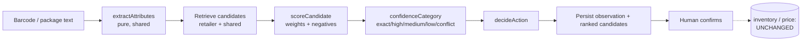

# Phase 3 — Local OCR, Barcode-Assisted Recognition & Deterministic Matching

Local-first product recognition built entirely on **deterministic, pure
functions** — no cloud AI, no image embeddings, no voice, no predictive
inventory. The device produces text (barcode or package text); the server
extracts attributes, retrieves and scores candidates, applies one central
confidence policy, and records evidence for a human to confirm. It **never**
changes inventory or the retailer's selling price.

## What was added (additive over Phase 2)

| Layer | New | Purpose |
|---|---|---|
| **shared** | `recognition.ts`, `scoring.ts` | pure OCR-text extraction + candidate scoring/confidence (unit-testable) |
| **server** | `recognition.service.ts`, `POST /kb/recognize`, `GET /kb/recent-scans` | orchestrates retrieval → score → persist observation/candidates |
| **db** | migration `0007_recognition_ocr.sql` | additive OCR/decision metadata on `recognition_observations` + `recognition_candidates` |
| **web** | `lib/ocr.ts`, `components/RecognizeModal.tsx`, Products "Read package" | provider-agnostic capture → recognition UI → human confirmation |
| **config** | `localOcr`, `hybridProductScan`, `packagingChangeDetection`, `printedPriceDetection`, `offlineProductRecognition` | feature flags (default on, env-overridable) |

## Recognition pipeline

### 1. Deterministic extraction (`packages/shared/src/recognition.ts`)
Pure functions over OCR/manual text, each independently tested:
- `fixNumericOcr` — common OCR confusions (`O→0`, `l/I→1`, `S→5`, `B→8`, `k9→kg`, `m1→ml`).
- `extractPrintedPrice` — `Rs`/`MRP`/`PKR`/`روپے`/`850/-`; **excludes** dates, batch numbers, years.
- `extractManufacturer` — "manufactured / marketed / packed / imported / distributed by".
- `extractPackSize` — tries each line, applies `fixNumericOcr`, parses from first digit ("Net 500 g").
- `detectPromotional` — new/free/extra/save/… on **raw** text (percent survives normalization).
- `extractBrandNameCandidates`, `extractAttributes` — the aggregate used by the server.

### 2. Deterministic scoring (`packages/shared/src/scoring.ts`)
`RECOGNITION_CONFIG` holds every weight, negative and threshold in one place.
Positive evidence adds (retailer exact barcode `100`, shared verified barcode
`95`, exact aliases, brand/variant/pack-size/manufacturer matches, recently
used, existing catalog link…). Contradictions subtract heavily (conflicting
barcode `-1000`, pack-size contradiction `-60`, retired/conflicted `-1000`).

`confidenceCategory` → `exact | high | medium | low | conflict`, and
`decideAction` → the recommended next step.

**Safety invariant (the reason this is deterministic):**
> A barcode match combined with a pack-size contradiction is classified
> **`conflict`** — never a high-confidence auto-select. The human resolves it.

This is covered by a dedicated CRITICAL integration test.

### 3. Orchestration (`recognition.service.ts`)
- Retailer candidates: fetch ≤300 active shop products, match barcode/name in JS (small catalogs).
- Shared candidates: by normalized barcode (SQL), then by name/alias (SQL); duplicate variants de-duped.
- Score → sort → slice to `candidateLimit`; compute overall category + action.
- `evaluatePackagingChange` (pack-size contradiction / promo / printed-price presence) and
  `evaluatePriceChange` (compares observed printed MRP to last observation / selling price — **reports only**).
- Persist observation + ranked candidates in one transaction. Fully tenant-scoped.

## Data model (migration 0007, additive only)
`recognition_observations` gains `ocr_full_text`, `ocr_provider`,
`ocr_provider_version`, `processing_ms`, `image_quality`,
`extracted_attributes` (JSONB), `confidence_category`, `recommended_action`,
`offline`. `recognition_candidates` gains `contradictions` (JSONB),
`confidence_category`, `display_name`. Every column is nullable/defaulted; no
existing row is modified.

## API
- `POST /api/kb/recognize` — `requireFeature('hybridProductScan')`, `PRODUCT_VIEW`.
  Body `{ barcode?, ocrText?, offline?, deviceId?, ocrProvider?, ocrProviderVersion?, processingMs?, imageQuality? }`
  (requires at least one of `barcode` / `ocrText`). Returns `{ observationId,
  confidence, recommendedAction, offline, barcode, extractedAttributes,
  candidates[], packagingChange, priceChange }`.
- `GET /api/kb/recent-scans` — `PRODUCT_VIEW`, tenant-scoped recent observations.
- Confirmation reuses the Phase 2 `POST /api/kb/observations/:id/confirm`.

## On-device OCR status (honest)
`apps/web/src/lib/ocr.ts` is a **provider abstraction**. There is **no
Capacitor-6-compatible MLKit text-recognition plugin** (`@capacitor-mlkit/text-recognition`
v8 requires Capacitor 8). Rather than force a risky Cap-8 upgrade in Phase 3,
the device provider reports `unsupported` and the UI falls back to **manual
package-text entry**, which flows through the *same* server engine. When the
app moves to Capacitor 8, add the MLKit provider inside `recognizeOnDevice`
without changing a single caller. **On-device OCR accuracy has therefore not
been measured on a device** — the extraction logic is validated by unit tests
over representative text, not by camera capture.

## Privacy & offline
No image or text leaves the device except the text the retailer submits to
their own tenant's API. Barcode and manual text both work offline-capable
paths; the `offline` flag is recorded on the observation. Prohibited items
(cloud AI, embeddings, voice, predictive inventory, auto catalog publication,
auto price/inventory changes) are **not** present.

## Tests
- **Shared unit (63):** `recognition.test.ts` (13), `scoring.test.ts` (10) added; plus normalize/packsize/barcode/money/roles.
- **Server integration (32):** `recognition.integration.test.ts` (8) added — Flow A (retailer barcode→exact),
  Flow C (OCR name+size), shared verified barcode→exact/add-to-shop, **CRITICAL barcode+packsize→conflict**,
  price-change detected with selling price unchanged, persistence+confirm+recent-scans, not-found→low, tenant isolation.
- All 95 tests executed and passing against a real Postgres 16 test database.
