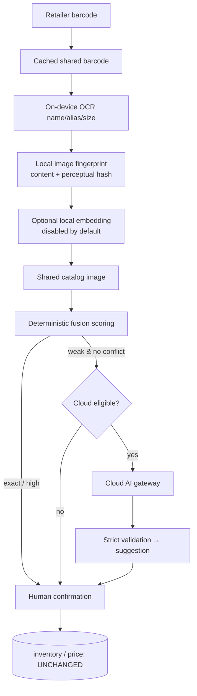

# Phase 4 — Local Image Matching, Secure Cloud AI Fallback & Cost Governance

Phase 4 improves recognition of products whose barcode/text evidence is weak by
adding **local image fingerprints** and a **secure, cost-governed cloud-AI
fallback** — while keeping cloud AI an *exception*, not the normal path. Every
addition is additive over Phase 3; disabling the cloud flag returns the exact
Phase-3 flow. **No AI output ever changes inventory or price** — results are for
human confirmation only.

## Recognition order (cheapest, most private first)

## Local visual matching (private, offline-capable)

- **Content hash** — `sha256` of the normalized image (server `fingerprint.service.ts`,
  client `lib/imagefp.ts`). Exact-duplicate/dedup only; never used for similarity.
- **Perceptual hash** — dHash over an 8×9 grayscale grid (`@smartdukaan/shared/imagefp`).
  Hamming distance → `near_identical | visually_similar | weak | none`. Algorithm+version
  tagged so **incompatible hashes are never compared**.
- **Retrieval** (`findVisualCandidates`) — indexed content-hash lookup, then a bounded
  perceptual scan over the shop's own + shared fingerprints (never the whole catalog).
- **Scoring** — visual signals are weighted **below** barcode/name (`content_hash_identical:45`,
  `perceptual_near:30`, `perceptual_similar:15`, `embedding_similar:≤20`), so an
  image-only match can never reach `exact` — it needs OCR/barcode corroboration.
- **Optional embeddings** — abstraction + `image_embeddings` table exist, model-versioned;
  the feature is **OFF by default** (`localImageEmbedding`) pending an evidence-based,
  device-measured model. No custom model is trained from retailer data.

## Cloud AI gateway (backend-only, provider-independent)

The client's ONLY path to cloud AI is `POST /api/cloud/recognize`. The coordinator
(`cloudRecognition.service.ts`) enforces, in order:

- **Provider-independent** (`provider/types.ts`): `mock` (deterministic, used by ALL
  tests) and `gemini` adapters. Default provider is `mock` — no real spend can occur
  without `AI_PROVIDER=gemini` + `GEMINI_API_KEY`.
- **Secrets backend-only** — the key is loaded via env, placed in a request header,
  never logged (logger redacts), never returned to a client, never in the APK.
- **Minimized inputs** — only a cropped/resized package image + OCR text + bounded
  candidates + country. Never customer/khata/inventory/financial data.
- **Strict validation** (`responseValidator.ts`) — the trust boundary. Enforces schema,
  enums, string lengths, integer-paisa money, ranges; **rejects any candidateId not in
  the backend-supplied allowed set**; always forces `requiresHumanConfirmation`. The
  provider can never name a tenant, price, or database id we didn't vet.
- **Prompt-injection defense** (`promptRegistry.ts`) — versioned prompt instructs the
  model to treat package text as data, never instructions; backend validation is the
  real guard, not the prompt.

## Cost governance

| Control | Mechanism | Default |
|---|---|---|
| Result cache | `ai_result_cache` keyed by content+ocr+provider+model+prompt+candidate-set+country | 30-day TTL |
| Dedup | content-hash lookup + cache before any call | on |
| Budget | `ai_budgets` reserve→consume→release, per shop/day, atomic under concurrency | 200 req / PKR 500 est. per day |
| Circuit breaker | `ai_provider_health`, opens after 5 failures for 60s | on |
| Rate limit | in-memory per user/shop/device/minute | 12/40/12 |
| Model routing | single cheap model; secondary behind flag | secondary off |
| Cost config | versioned `ai_cost_config` (integer paisa, **estimate not invoice**) | seeded (0009) |

**Budget exhaustion never blocks local/manual entry** — only the cloud call. The client
shows a calm message and continues with barcode/OCR/local/manual paths.

## Privacy & consent

- Per-shop consent (`cloud_consent_preferences`): `always | ask | never`, Wi-Fi-only,
  save-confirmed-image. Default **ask** — cloud is never used silently.
- Image safety screen (`imageSafety.ts`): structural validation (MIME/size/dimension/
  decompression-bomb, magic-number vs declared MIME) + client safety hints; a
  person/document/payment hint **blocks** the upload. Honestly documented: this is
  heuristic, **not** perfect sensitive-content detection.
- Temporary scan images are not persisted by the backend in Phase 4 (only hashes +
  validated structured results); confirmed reference images follow the retention policy.

## Data model (migrations 0008 additive, 0009 seed)

`image_fingerprints`, `image_embeddings`, `embedding_models`, `cloud_prompt_versions`,
`ai_cost_config`, `ai_budgets`, `ai_usage_events`, `ai_provider_health`,
`ai_result_cache`, `cloud_recognition_requests`, `cloud_consent_preferences`,
`image_safety_results`. All `CREATE TABLE IF NOT EXISTS` / nullable — no existing row
is modified. 0009 seeds cost basis + prompt mirror idempotently.

## APIs

| Endpoint | Purpose | Auth |
|---|---|---|
| `GET /api/cloud/eligibility` | safe availability + budget category | product:view |
| `POST /api/cloud/recognize` | cloud fallback (mock by default) | product:view + rate limit + flag |
| `GET /api/cloud/usage` | tenant-safe usage summary | product:view |
| `GET/PUT /api/cloud/consent` | cloud consent preference | product:view |
| `POST /api/cloud/fingerprints` | save a confirmed product's fingerprint | product:manage |
| `POST /api/kb/recognize` (extended) | now accepts image fingerprints for local visual match | product:view |

## Feature flags (rollback to Phase 3)

`localImageFingerprint`, `localVisualMatching` (on); `localImageEmbedding` (off);
`sharedVisualMatching` (on); `cloudProductRecognition` (**off**), `cloudRecognitionConsent`,
`cloudRecognitionCache`, `cloudRecognitionBudget` (on); `cloudRecognitionSecondaryModel` (off);
`packagingVisualChangeDetection`, `aiUsageDashboard` (on). Turning off
`cloudProductRecognition` returns the Phase-3 barcode/OCR flow with zero cloud calls.

## Tests (all executed)

- **Shared unit (85):** +`imagefp.test.ts` (8), +`fusion.test.ts` (10), +visual scoring cases.
- **Server (54):** +`cloud.integration.test.ts` (14, mock provider) covering Flow A (local image),
  C+D (cloud + cache reuse), E (budget exhaustion), F (provider timeout+circuit), security
  (candidate-id validation, malformed output, prompt injection, safety block, MIME spoof),
  rate limiting, consent gating, tenant isolation; +`responseValidator.test.ts` (8).
- **No real paid provider calls** — the deterministic mock drives every path.

## Manifests

### File Manifest (selected)
| File | C/M | Purpose | Tests |
|---|---|---|---|
| `shared/src/imagefp.ts` | C | perceptual hash + comparison | imagefp.test.ts |
| `shared/src/fusion.ts` | C | multi-signal fusion + cloud gate | fusion.test.ts |
| `shared/src/cloudtypes.ts` | C | structured cloud contract + validators | responseValidator/cloud tests |
| `shared/src/scoring.ts` | M | visual weights/negatives | scoring.test.ts |
| `server/.../cloud/*` | C | gateway, provider, budget, cache, breaker, validator | cloud/responseValidator tests |
| `server/.../rateLimit.ts` | C | cloud rate limiting | cloud.integration.test.ts |
| `server/migrations/0008,0009` | C | visual+AI tables, seed | applied + verified |
| `server/.../recognition.service.ts` | M | fuse image evidence | recognition/cloud tests |
| `web/src/lib/imagefp.ts` | C | client hashing + minimization | build |
| `web/.../RecognizeModal.tsx` | M | fingerprint + online-check UI | build |

### Provider Manifest
| Provider | Model | Prompt | Data policy | Status |
|---|---|---|---|---|
| mock | mock-vision v1 | product_recognition@1 | no data leaves process | active (default, tests) |
| gemini | gemini-2.0-flash | product_recognition@1 | minimized image+text only; key backend-only | adapter ready, disabled |

### Cost-Control Manifest
| Control | Scope | Threshold | Action | Status |
|---|---|---|---|---|
| Budget | shop/day | 200 req / PKR 500 est | block cloud, keep local | active |
| Cache | content+context | 30d | reuse, no charge | active |
| Rate limit | user/shop/device | 12/40/12 per min | 429 | active |
| Circuit breaker | provider/model | 5 fails → 60s | skip provider | active |

### Migration Manifest
| Migration | Purpose | Data impact | Rollback/forward |
|---|---|---|---|
| 0008 | visual + AI tables | additive; no row changed | drop new tables (forward-fix) |
| 0009 | cost/prompt seed | inserts config only | idempotent; safe re-run |

## Remaining limitations (honest)

- **No on-device OCR/embedding measured on a device** — perceptual hashing is validated
  on synthetic matrices; camera-capture accuracy is not measured (carried from Phase 3).
- **Cloud accuracy not measured against a real provider** — the mock is deterministic;
  provider accuracy requires a controlled paid evaluation, not run here.
- **Safety detection is heuristic** — structural + client hints only; no pixel-level
  face/document model.
- **Rate limiter is in-memory** — accurate per instance; multi-instance needs Redis.
- **Cost is an estimate, not an invoice** — real spend is provider-billed.
- **Android APK not compiled here** — no Android SDK in the container; no native dep added,
  so the project is structurally unchanged (carried from Phase 3).

## Phase 5 integration points

The fusion service, provider abstraction, budget/usage ledger and consent surface are the
seams a Phase-5 voice assistant would reuse (a voice query becomes another evidence source
feeding the same deterministic fusion; the same cost governance applies to any future
paid modality). No Phase-4 refactor is required.
