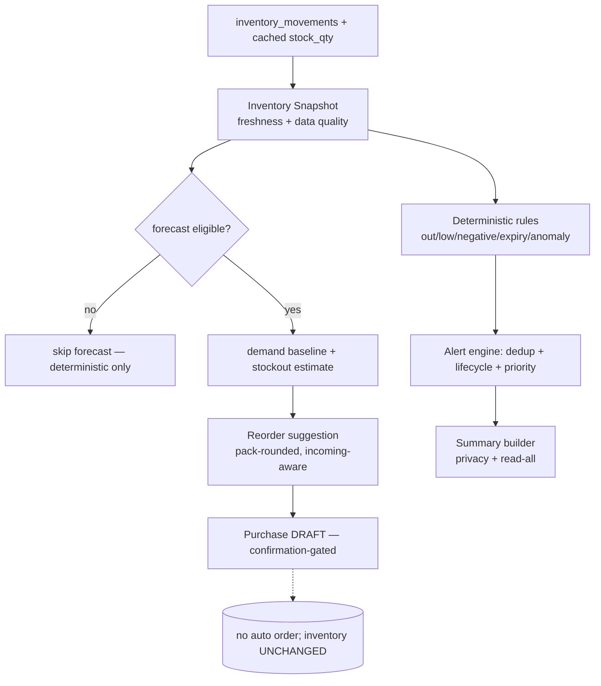

# Phase 6 — Inventory Intelligence, Controlled Alerts & Spoken Summaries

Turns verified inventory/sales/purchase data into explainable, controlled
assistance: deterministic alerts first, then forecasting only where data
suffices, explainable reorder suggestions, privacy-aware spoken summaries, and
alert-frequency management. It **never** changes inventory, never places an
order, never treats a forecast as fact.

## Layered pipeline

## One common snapshot
`snapshot.service.ts` builds `InventorySnapshot` from the append-only
`inventory_movements` + cached `products.stock_qty` + pending purchase drafts.
Every alert/forecast/summary reads it, so results never disagree. Carries
**freshness** (`current…conflicted…stale`) and **data-quality**
(`good…insufficient_for_forecast`) through every result. Reads only — never writes stock.

## Deterministic rules (before any forecast)
`rules.ts` (pure): out-of-stock, low-stock, negative-stock (critical),
expiring-soon/expired/expiry-missing (only where an expiry date is recorded),
large-adjustment (**neutral, non-accusatory language**), stock-count-overdue,
opening-stock-missing, pending-sync. Intentionally-unstocked/inactive products
are not nagged. Each alert has a stable **condition key + bucket** so a
worsening condition (low→zero) re-alerts but a re-run does not duplicate.

## Controlled forecasting
`forecast.ts` (pure, versioned `v1`): demand baselines (recent/weighted/median/
day-of-week) with a **minimum-data guard** (≥5 non-zero sale days, ≥14 days
history) — below that, forecasting is **skipped**, not invented. Confidence
(high/medium/low/insufficient) from history length + coefficient of variation.
Stockout is always an **estimate** ("may last about N days"), never a fact; `null`
when demand ~0 or data is insufficient.

## Explainable reorder
`reorder.ts` (pure): suggested units ≈ demand × (coverage + lead time) + safety
stock − available − incoming, **rounded up to pack size** and the minimum order,
then capped. Suppressed when a pending order/draft or sufficient incoming stock
already covers the need, or when history is insufficient (with a data warning).
Lead-time source is labelled (verified/partner/estimated/unknown). The reorder
service can create a **purchase DRAFT** (`purchase_drafts`, confirmation-gated) —
never a real purchase/order.

## Alerts: priority, dedup, lifecycle, frequency
`priority.ts` (pure): severity + product importance ranking (integrity beats
promotions); dedup key is tenant/shop-scoped; `shouldResurface` gates repeats to
meaningful change or snooze expiry; daily/per-product caps. `alerts.service.ts`
recomputes deterministically, upserts by `dedup_key` (no duplicates on re-run),
**auto-resolves** conditions that no longer hold, and manages
acknowledge/snooze/dismiss/resolve with an `alert_actions` audit trail.

## Spoken summaries (privacy-aware)
`summary.ts` (pure) + `summary.service.ts`: opening/closing/on-demand summaries
from real data (snapshots + dashboard totals). Leads with the most-urgent item,
bounds spoken items to 3 with a **"read all"** control, and in **privacy mode**
suppresses exact amounts (generic "open Smart Dukaan to review"). Reuses Phase-5
TTS on the client.

## Preferences & quiet hours
`preferences.service.ts`: per-shop spoken-alert mode (never/when_open/while_active/
summary_time/critical_only), privacy mode, quiet hours, daily summary opt-in.
`spokenAllowed()` enforces mode + quiet hours (critical alerts may still speak).
Proactive spoken alerts while the app is closed are **off by default**.

## Voice integration
Phase-5 taxonomy extended (read-only): `ask_reorder` ("what should I order"),
`ask_expiry`, `ask_finishing_soon`, `ask_needs_attention` (+ existing low-stock/
summary). The reorder answer never claims an order was placed — it points to the
purchase list to confirm.

## Data model (migration 0011, additive)
`inventory_alerts` (`UNIQUE(tenant, dedup_key)`, lifecycle status), `alert_deliveries`,
`alert_preferences`, `alert_actions`, `forecast_evaluations`, `purchase_drafts`;
plus nullable product columns (`expiry_date`, `reorder_qty`, `importance`,
`intentionally_unstocked`, `last_stock_count_at`, `supplier_lead_time_days`). No
existing balance/sale/purchase/price row modified; older clients need none of it.

## APIs
`GET /api/intelligence/alerts` (recompute+list), `POST /alerts/:id/action`,
`GET /reorder` + `/reorder/:productId`, `POST /purchase-drafts` (purchase:manage),
`GET /purchase-drafts`, `GET /summary`, `GET/PUT /preferences`. All tenant-scoped,
permission-gated.

## Feature flags (rollback)
`inventoryIntelligence`, `deterministicLowStockAlerts`, `stockoutProjection`,
`demandBaseline`, `reorderSuggestions`, `expiryAlerts`, `anomalyAlerts`,
`slowMovingIndicators`, `dailyOpening/ClosingSummary`, `alertGrouping`,
`offlineInventoryIntelligence` (on); `proactiveSpokenAlerts`,
`sponsoredSupplierOffers` (**off**). Disabling `inventoryIntelligence` returns
plain inventory screens.

## Tests (all executed)
- **Shared unit: 144** (+26 intelligence: snapshot classifiers, deterministic rules,
  forecast skip/estimate/weighting, reorder pack-rounding/pending-suppression/insufficient,
  priority/dedup/resurface, summary privacy + read-all).
- **Server integration: 82** (+12: Flow A low-stock-after-sale with dedup + no stock change,
  out-of-stock→auto-resolve on restock, neutral large-adjustment, expiry, snooze lifecycle,
  Flow C reorder draft with **no real purchase**, forecast-skip on thin history, on-demand +
  privacy summary, voice "what should I order" read-only, cashier-denied draft, tenant isolation).
- All against real Postgres 16; **no paid services**.

## Manifests

### Alert Manifest
| Type | Trigger | Severity | Frequency |
|---|---|---|---|
| negative_stock / conflict | onHand<0 / device conflict | critical | dedup, resurface on change |
| out_of_stock | available≤0 | urgent | bucket=zero |
| large_adjustment | \|Δ\|≥100 | urgent | neutral text |
| expiring_soon / expired | recorded expiry ≤3d / past | important/urgent | day bucket |
| low_stock | available≤threshold | important | half/near bucket |
| stock_count_overdue / opening_missing / expiry_missing / pending_sync | see rules | helpful | dedup |

### Forecast Manifest
| Algorithm | Version | Min data | Purpose |
|---|---|---|---|
| recent/weighted/median/day-of-week | 1 | ≥5 non-zero days, ≥14 days | daily demand baseline |
| stockout projection | 1 | eligible baseline + demand>0 | days-remaining estimate |

### Test Manifest
| Suite | Run | Passed | Failed |
|---|--:|--:|--:|
| shared unit | 144 | 144 | 0 |
| server integration | 82 | 82 | 0 |

## Remaining limitations (honest)
- Forecast accuracy not field-measured; validated on synthetic/seeded series only.
- Amount-only sales carry no product; product-level demand excludes them (by design).
- No incoming/pending-order model in core purchases → `incoming` derives from drafts only.
- Expiry intelligence works only where an expiry date is recorded (no shelf-life inference).
- Supplier lead time is a per-product estimate (no historical order-to-delivery yet).
- Offline intelligence + reconciliation are specified/flagged; deep client offline recompute is future work.
- Multi-device conflict flag is scaffolded (server is the synced source of truth here).
- Android APK not compiled here (no SDK; no new native dep — structurally unchanged).

## Phase 7 readiness
The snapshot, deterministic rules, versioned forecast provider, alert lifecycle
and preference surface are clean seams for Phase 7 (store memory, self-learning
matching, personalization) — e.g. forecast_evaluations already records predicted
vs actual for later tuning under controlled review. **Ready for Phase 7 with
corrections** (the measurement gaps above are evidence to gather, not refactors).
